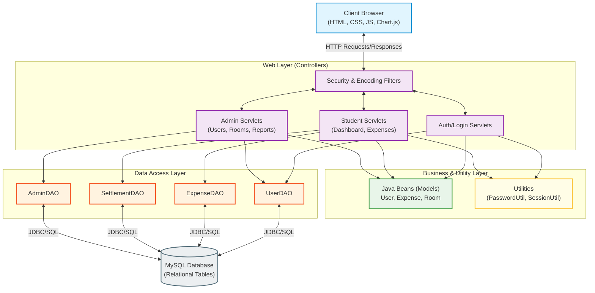

# HostelMate — Hostel Expense Management System

## 1. Project Overview
**HostelMate** is a comprehensive, production-ready Java Web Application designed specifically for college hostel residents. Its primary goal is to eliminate the confusion and disputes associated with shared expenses by providing a centralized platform for managing rent, mess bills, utility payments, and roommate settlements.

### Key Objectives
* **Transparency:** Ensure every resident knows exactly what they owe and to whom.
* **Automation:** Automate complex calculations for split expenses (both equal and custom splits).
* **Role-Based Access Control:** Differentiate between Hostel Administrators (managing rooms, users, and overall reports) and Students (managing daily expenses).

---

## 2. Architecture Diagram

The application is built on a **3-Tier Architecture** pattern (Presentation, Business Logic, and Data Access), utilizing the Model-View-Controller (MVC) design pattern on the server side.

---

## 3. Technology Stack & Justification

When asked *“Why did you choose these technologies?”* during an interview, here is how you can justify them:

### Frontend
* **HTML5, CSS3, JavaScript (Vanilla):** Keeps the application lightweight without the overhead of heavy frameworks like React or Angular. Perfect for server-rendered pages.
* **JSP (JavaServer Pages):** Allows dynamic content generation directly from Java backend objects using Expression Language (`${...}`) and JSTL.
* **Chart.js:** Used for the dashboard analytics. It was chosen because it renders high-performance HTML5 canvas charts and is extremely easy to integrate via CDN.
* **Design Pattern (Glassmorphism & Dark Mode):** Demonstrates a strong understanding of modern UI/UX trends, making the project stand out visually from traditional academic projects.

### Backend
* **Java 11:** The core programming language. Chosen for its robust object-oriented features, strong typing, and enterprise-grade reliability.
* **Servlets:** The foundation of Java web applications. Using pure Servlets demonstrates a foundational understanding of HTTP request/response lifecycles, session management, and routing before relying on abstractions like Spring Boot.
* **BCrypt (jBCrypt):** Used for password hashing. Justification: BCrypt automatically handles salting and is computationally expensive, making it highly resistant to dictionary and rainbow table attacks.

### Database
* **MySQL 8.0+:** A powerful open-source Relational Database Management System (RDBMS).
* **JDBC (Java Database Connectivity):** Used for direct database communication via `PreparedStatement`. Justification: Prepared statements prevent SQL Injection attacks by pre-compiling the SQL query and treating user inputs strictly as parameters, not executable code.

### Build Tool
* **Maven:** Used for dependency management and building the `.war` (Web Application Archive) file. It simplifies project structuring and automatically downloads required JARs (like MySQL connector and BCrypt).

---

## 4. Key Architectural Patterns Used

1. **MVC (Model-View-Controller):**
   * **Model:** Plain Old Java Objects (POJOs) representing database entities (e.g., `User.java`, `Expense.java`).
   * **View:** JSP files (`.jsp`) responsible solely for rendering the UI.
   * **Controller:** Servlets (e.g., `ExpenseServlet.java`) that process incoming HTTP requests, interact with the DAO layer, and forward data to the Views.

2. **DAO (Data Access Object) Pattern:**
   * Separates the high-level business logic from the low-level database API operations (JDBC). Instead of writing SQL inside Servlets, the Servlet calls `expenseDAO.addExpense()`. This makes the code modular, reusable, and easier to maintain.

3. **Singleton Pattern:**
   * The `DBConnection.java` utility acts as a factory providing JDBC connections. It loads the database driver into memory exactly once (using a static block), optimizing memory usage.

4. **Filter Pattern:**
   * Used `AuthFilter.java` to intercept incoming requests and verify session tokens. If a user is not logged in, they are blocked from accessing protected pages. This centralizes security rather than checking session status manually in every single Servlet.

---

## 5. Potential Interview Questions & Answers

**Q: How does the application handle expense splitting?**
*A: When a user creates an expense, they specify the amount and the split type (Equal or Custom). The `ExpenseServlet` iterates through the selected roommates. If it's an "Equal" split, the backend divides the total amount by the number of participants and creates individual `expense_shares` records in the database. The person who paid gets a 'paid' status, while others get 'unpaid' dues.*

**Q: How did you secure the application?**
*A: Security was implemented at three levels:*
1. **Database Level:** Passwords are never stored in plain text; they are hashed using BCrypt.
2. **Application Level:** SQL Injection is prevented by strictly using JDBC `PreparedStatement` for all queries. Cross-Site Scripting (XSS) is mitigated by encoding user inputs on the frontend.
3. **Session Level:** An `AuthFilter` ensures that users cannot access internal pages by bypassing the login page via direct URLs.

**Q: How do settlements work?**
*A: The system calculates net balances by aggregating all unpaid `expense_shares` between two users. When user A pays user B, a `Settlement` record is created, and the corresponding expense shares are marked as `is_paid = true`, zeroing out the balance.*

**Q: What happens if two people try to add an expense at the exact same time?**
*A: Since we use MySQL with InnoDB engine, it handles concurrent connections using Row-Level Locking and ACID properties. The Servlets themselves do not store state (they are stateless), meaning concurrent HTTP threads can safely execute DAO methods simultaneously.*

---
*End of Document. Good luck with your MCA Project Viva and Interviews!*
